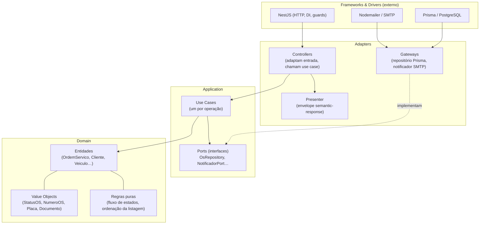
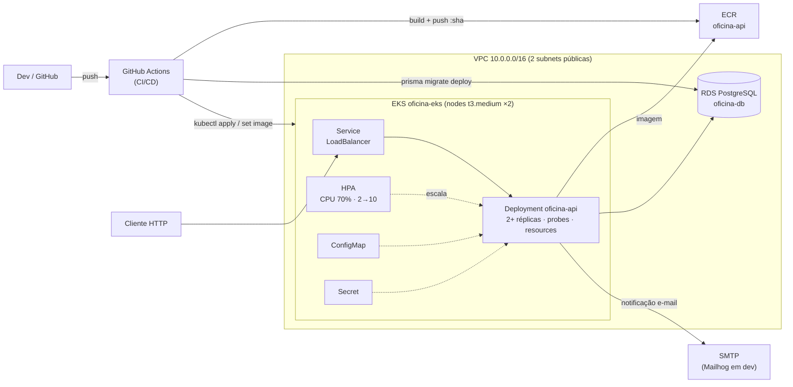
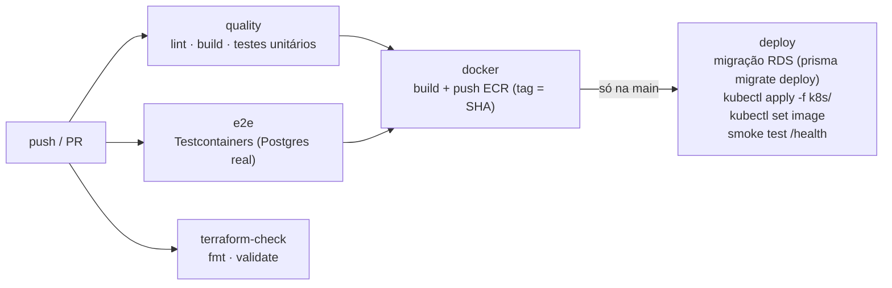

# Oficina API - Tech Challenge FIAP (Fase 2)

API REST para gestão de ordens de serviço (OS) de uma oficina mecânica, desenvolvida para o Tech Challenge da pós-graduação em Software Architecture (FIAP, 14SOAT).

## 1. Descrição da solução e objetivos da fase

O sistema da Fase 1 gerencia o ciclo completo de uma oficina: autenticação e usuários internos, clientes, veículos, catálogo de serviços, estoque de insumos (com compras) e ordens de serviço, do recebimento do veículo à entrega, passando por diagnóstico, orçamento, aprovação do cliente e execução.

**Objetivos da Fase 2:** evoluir essa base para garantir qualidade, resiliência e escalabilidade:

- **Clean Architecture**: refatoração de todos os módulos em camadas `domain / application / adapters`, com regra de dependência apontando para dentro e SOLID aplicado;
- **Testes automatizados** dos fluxos críticos (casos de uso da OS): unitários com mocks dos gateways + e2e com banco real (Testcontainers);
- **APIs da OS**: criação, consulta pública de status, webhook de aprovação/recusa de orçamento, listagem ordenada por prioridade de status com exclusão lógica e notificação por e-mail na mudança de status;
- **Kubernetes** com autoescala (Deployment 2+ réplicas, Service, ConfigMap, Secret e HPA);
- **IaC com Terraform** (EKS + RDS + ECR na AWS, state remoto em S3);
- **CI/CD** com GitHub Actions: lint → build → testes → e2e → imagem Docker → migração do banco → deploy no cluster.

## 2. Arquitetura

### 2.1 Camadas da aplicação (Clean Architecture)

Cada módulo de `src/modules/` (`auth`, `usuarios`, `clientes`, `veiculos`, `servicos`, `insumos`, `ordens-servico`) segue a mesma estrutura em camadas, com a regra de dependência apontando sempre para dentro:



Regras seguidas (invioláveis):

- `domain` não importa nada de Nest/Prisma; `application` só importa `domain`; `adapters` importam `application`/`domain`. O wiring (providers) fica no módulo Nest.
- Use cases recebem dependências **por interface (ports)** via injeção, o que permite testá-los com mocks.
- Regras de negócio (transições de status, ordenação da listagem) são código puro de domínio, não SQL.
- **Decisão registrada:** o envelope de resposta padronizado (`semantic-response`, via interceptor global) cumpre o papel de **Presenter**: formata toda saída HTTP num único ponto.

### 2.2 Infraestrutura provisionada (Terraform / AWS)



Recursos completos, trade-offs do AWS Academy e comandos: [infra/README.md](infra/README.md).

### 2.3 Fluxo de deploy (CI/CD)

Workflow único [.github/workflows/ci.yml](.github/workflows/ci.yml), estratégia de branches **GitHub Flow** (main implantável + feature branches + PRs):



O `terraform apply` é **manual e documentado**: as credenciais do AWS Academy expiram por sessão, e um apply automático quebraria a pipeline de forma intermitente. A pipeline valida o Terraform (`fmt`/`validate`) e faz o deploy da aplicação.

## 3. Como executar

### 3.1 Local (docker compose)

Pré-requisitos: Docker + Docker Compose.

```bash
# Linux/macOS
cp .env.example .env
# Windows PowerShell
Copy-Item .env.example .env

docker compose up -d --build
```

| Serviço                          | URL                            |
| -------------------------------- | ------------------------------ |
| API                              | <http://localhost:3000>        |
| Swagger                          | <http://localhost:3000/docs>   |
| Health                           | <http://localhost:3000/health> |
| Mailhog (e-mails de notificação) | <http://localhost:8025>        |

Comandos de referência: `docker compose up`, `docker compose build`, `docker compose logs`, `docker compose ps`, `docker compose down`.

O entrypoint do container roda as migrações (`prisma migrate deploy`) e o seed automaticamente. Usuário administrador é criado no bootstrap com `ADMIN_BOOTSTRAP_EMAIL`/`ADMIN_BOOTSTRAP_PASSWORD` do `.env`.

<details>
<summary>Rodar sem Docker (Postgres local)</summary>

```bash
npm install
cp .env.example .env   # ajustar DATABASE_URL para o Postgres local
npx prisma migrate dev
npm run db:seed
npm run start:dev
```

</details>

### 3.2 Kubernetes local (minikube)

Os manifestos de `k8s/` (Deployment com probes e resources, Service LoadBalancer, ConfigMap, Secret via `kubectl create secret`, HPA 2→10 réplicas) sobem tanto no minikube quanto no EKS. Resumo minikube:

```bash
minikube start && minikube addons enable metrics-server
minikube image build -t oficina-api:local .
kubectl apply -f k8s/local/        # Postgres + Mailhog (só local)
kubectl create secret generic oficina-secrets --from-literal=...   # ver k8s/README.md
kubectl apply -f k8s/
```

Passo a passo completo, acesso à aplicação, troubleshooting e teste de carga: [k8s/README.md](k8s/README.md).

### 3.3 Provisionamento AWS (Terraform)

```powershell
cd infra
terraform init
terraform fmt -check && terraform validate
terraform plan
terraform apply    # EKS ~10-15 min
aws eks update-kubeconfig --region us-east-1 --name oficina-eks
kubectl apply -f ../k8s/
```

> **AWS Academy:** as credenciais do Learner Lab expiram a cada sessão. Rode `.\scripts\aws-academy-refresh.ps1` para renovar `~/.aws/credentials` e os secrets do GitHub em um comando. Recursos criados, bootstrap do bucket de tfstate e trade-offs: [infra/README.md](infra/README.md).

### 3.4 Testes

```bash
npm test              # unitários (use cases e entidades, gateways mockados)
npm run test:cov      # unitários com cobertura (thresholds no package.json)
npm run test:e2e      # e2e com Testcontainers (requer Docker rodando)
                      # (antes: cp .env.test.example .env.test)
```

Teste de carga (demonstração do HPA): script [k6/load-test.js](k6/load-test.js), com comando e resultado esperado em [k8s/README.md](k8s/README.md#teste-de-carga-k6--demonstração-do-hpa).

## 4. APIs

Mapeamento dos requisitos obrigatórios para os endpoints reais (os nomes de rota mantêm o padrão da Fase 1):

| Requisito                                                                                                                                         | Endpoint                                                                                                                                                                                       | Auth                                         |
| ------------------------------------------------------------------------------------------------------------------------------------------------- | ---------------------------------------------------------------------------------------------------------------------------------------------------------------------------------------------- | -------------------------------------------- |
| Abertura de OS (retorna id único, número `OS-<ano>-<seq>`)                                                                                        | `POST /os`                                                                                                                                                                                     | JWT (atendente/admin)                        |
| Consulta de status                                                                                                                                 | `GET /os/publica/:numero?documento=` (sem dados sensíveis) · `GET /os/:id`                                                                                                                     | Pública · JWT                                |
| Webhook aprovação/recusa de orçamento                                                                                                             | `POST /os/:numero/orcamento/aprovar` · `POST /os/:numero/orcamento/rejeitar`                                                                                                                   | Pública (validação por documento do cliente) |
| Listagem ordenada (Execução > Aguard. Aprovação > Diagnóstico > Recebida; antigas primeiro; Finalizada/Entregue ocultas por exclusão lógica)      | `GET /os`                                                                                                                                                                                      | JWT                                          |
| Atualização de status com notificação por e-mail                                                                                                  | `POST /os/:id/diagnostico/iniciar`, `POST /os/:id/orcamento/gerar`, `POST /os/:id/finalizar`, `POST /os/:id/entregar` etc.; cada transição dispara e-mail via `NotificadorPort` (SMTP/Mailhog) | JWT                                          |

A API completa (auth, usuários, clientes, veículos, serviços, insumos/compras e todas as operações de OS) está documentada no **Swagger**: `http://localhost:3000/docs`.

### Collection

- **Bruno** (collection oficial, versionada): pasta [bruno/Oficina-API](bruno/Oficina-API). Abrir com [Bruno](https://www.usebruno.com/downloads) via **Open Collection**, selecionar o ambiente **Local** e executar `Auth > Login` (o script salva o JWT na variável `token` automaticamente).
- **Postman** (export equivalente): [bruno/oficina-api.postman_collection.json](bruno/oficina-api.postman_collection.json). Basta importar no Postman; a variável de collection `url` aponta para `http://localhost:3000`.

## 5. Vídeo demonstrativo

> 🎬 **Link:** _a publicar_

## 6. Decisões e trade-offs

- **Clean Architecture pragmática:** camadas `domain/application/adapters` dentro de cada módulo NestJS, usando a DI do próprio Nest como mecanismo de injeção. A migração foi incremental, módulo a módulo, com os e2e como rede de segurança (o comportamento externo não mudou na refatoração).
- **PostgreSQL:** ACID para movimentação de estoque e aprovação de orçamento, tipos nativos para valores monetários, modelo relacional adequado ao domínio e integração de primeira classe com o Prisma.
- **EKS no AWS Academy + `LabRole`:** o Academy não permite criar IAM roles, então cluster e node group usam a `LabRole` pré-existente via data source. Subnets públicas para evitar o custo de NAT Gateway no lab.
- **RDS público** (`publicly_accessible = true`): o runner do GitHub Actions precisa alcançar o banco para rodar as migrações. Em produção real, o banco ficaria só na VPC, com migração via bastion ou Job no cluster.
- **`terraform apply` manual:** as credenciais do Academy expiram por sessão, e um apply automático quebraria a pipeline de forma intermitente. A pipeline só valida (`fmt`/`validate`) e faz o deploy da app.
- **GitHub Flow:** main sempre implantável, feature branches + PRs com revisão. Adequado ao deploy contínuo com versão única em produção.
- **Notificação via SMTP (Nodemailer)** atrás da interface `NotificadorPort`: dev usa Mailhog no compose, produção troca por provedor real via ConfigMap/Secret e os testes mockam a interface. Falha de SMTP nunca falha a operação de negócio.
- **Evolução futura:** observabilidade (OpenTelemetry/Prometheus/Grafana), fora do escopo obrigatório da fase.

---

## Apêndice

### Stack

| Camada         | Tecnologia                        |
| -------------- | --------------------------------- |
| Runtime        | Node.js + TypeScript              |
| Framework      | NestJS 11                         |
| Banco          | PostgreSQL 18 (RDS em produção)   |
| ORM            | Prisma 6                          |
| Autenticação   | JWT + Argon2                      |
| Testes         | Jest + Supertest + Testcontainers |
| Carga          | k6                                |
| Cliente de API | Bruno (export Postman disponível) |
| Containers     | Docker + Docker Compose           |
| Orquestração   | Kubernetes (EKS / minikube)       |
| IaC            | Terraform (state em S3)           |
| CI/CD          | GitHub Actions                    |
| E-mail (dev)   | Mailhog                           |

### Dados iniciais (seed)

`npm run db:seed` popula usuários (atendente, mecânico, estoquista), clientes, veículos, serviços e insumos. Credenciais de exemplo estão no corpo da request `Auth > Login` da collection.

### Variáveis de ambiente

Base em `.env.example`. Obrigatórias: `PORT`, `DATABASE_URL`, `JWT_SECRET`. Também usadas: `JWT_EXPIRES_IN`, `ADMIN_BOOTSTRAP_EMAIL`, `ADMIN_BOOTSTRAP_PASSWORD`, `SMTP_HOST`, `SMTP_PORT`, `SMTP_FROM` (e `SMTP_USER`/`SMTP_PASS` opcionais).

### Banco de dados e Prisma

Schema multi-arquivo em `prisma/`, migrations em `prisma/migrations/`. Comandos úteis: `npx prisma format | validate | generate | migrate dev | migrate deploy | studio`.

### SonarQube local (opcional)

```bash
npm run sonar:up
npm run test:cov
# export SONAR_TOKEN=...   (gerar em http://localhost:9000 > My Account > Security)
npm run sonar:scan
```
