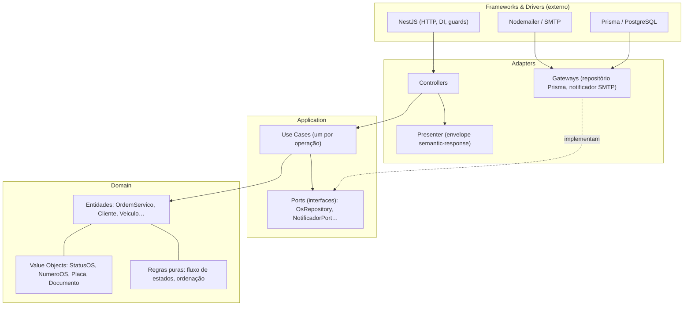
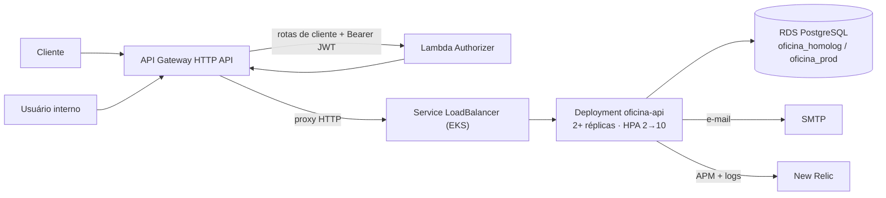

# tc-oficina-app — Oficina API

[](https://github.com/FIAP-POS-TECH-SOFTWARE-ARCHITECTURE/tc-oficina-app/actions/workflows/ci.yml)

Aplicação principal do sistema da oficina mecânica — Tech Challenge FIAP SOAT, Fase 3,
grupo **Integradores**. API REST NestJS em Clean Architecture para gestão de ordens de
serviço (OS).

## Propósito ✱

Gerencia o ciclo completo de uma oficina: usuários internos, clientes, veículos, catálogo de
serviços, estoque de insumos (com compras) e ordens de serviço — do recebimento do veículo à
entrega, passando por diagnóstico, orçamento, aprovação do cliente e execução. A listagem de
OS é ordenada por prioridade de status, com exclusão lógica, e cada transição de status
dispara notificação por e-mail.

Na Fase 3 esta aplicação passou a rodar atrás de um **API Gateway HTTP API**, com
autenticação de cliente por **CPF**: o cliente obtém um JWT na Lambda `tc-oficina-lambda-auth`
e usa esse token nas rotas sensíveis (`GET /os/acompanhamento/:numero`,
`POST /os/:numero/orcamento/aprovar` e `/rejeitar`), validadas por um Lambda Authorizer
antes de chegar aqui. Usuários internos continuam autenticando pela própria API (JWT +
Argon2, guard de papéis). A aplicação roda em dois ambientes — `homolog` e `prod` — separados
por namespace no EKS e por banco lógico no RDS, e emite telemetria para o New Relic (APM,
logs estruturados com `requestId`, métricas de negócio).

O provisionamento de infraestrutura (VPC, EKS, ECR, RDS) foi extraído para os repositórios
`tc-oficina-infra-k8s` e `tc-oficina-infra-db`; este repositório contém a aplicação, os
manifestos Kubernetes (`k8s/`) e o pipeline que faz o deploy.

## Tecnologias ✱

| Camada | Tecnologia |
| --- | --- |
| Runtime | Node.js 22 + TypeScript |
| Framework | NestJS 11 |
| Banco | PostgreSQL 18 (RDS em produção) |
| ORM | Prisma 6 |
| Auth interna | JWT + Argon2 |
| Auth de cliente | JWT HS256 emitido pela Lambda, validado por Lambda Authorizer + `JwtAuthGuard` |
| Testes | Jest + Supertest + Testcontainers |
| Carga | k6 |
| Observabilidade | New Relic (APM + `nestjs-pino` + `nri-bundle`) |
| Containers | Docker + Docker Compose |
| Orquestração | Kubernetes (EKS / minikube), Kustomize, HPA |
| CI/CD | GitHub Actions |
| E-mail (dev) | Mailhog |
| Cliente de API | Bruno (export Postman disponível) |

## Arquitetura deste repositório ✱

Cada módulo de `src/modules/` (`auth`, `usuarios`, `clientes`, `veiculos`, `servicos`,
`insumos`, `ordens-servico`) segue a mesma estrutura em camadas, com a regra de dependência
apontando sempre para dentro:



Regras invioláveis: `domain` não importa Nest/Prisma; `application` só importa `domain`;
`adapters` importam `application`/`domain`. Use cases recebem dependências por interface
(ports) via injeção. Regras de negócio (transições de status, ordenação) são código puro de
domínio. O envelope de resposta padronizado (`semantic-response`, interceptor global) cumpre
o papel de Presenter.

Posição no ecossistema (o cliente entra pelo API Gateway; as rotas internas passam pelo
catch-all sem authorizer):



> **Documentação arquitetural completa da Fase 3** (diagrama de componentes, diagramas de
> sequência, RFCs, ADRs e justificativa do banco com DER):
> [`docs/arquitetura/`](docs/arquitetura/README.md). Observabilidade (dashboards, alertas e
> runbook): [`docs/observabilidade/`](docs/observabilidade/README.md). Documento de entrega
> da fase: [`docs/entrega/`](docs/entrega/entrega-fase-3.md).

### APIs

| Requisito | Endpoint | Auth |
| --- | --- | --- |
| Abertura de OS (retorna id + número `OS-<ano>-<seq>`) | `POST /os` | JWT interno (atendente/admin) |
| Consulta de status | `GET /os/acompanhamento/:numero` (sem dados sensíveis) · `GET /os/:id` | Token de cliente (CPF) · JWT interno |
| Aprovação/recusa de orçamento | `POST /os/:numero/orcamento/aprovar` · `/rejeitar` | Token de cliente (CPF) |
| Listagem ordenada (Execução > Aguard. Aprovação > Diagnóstico > Recebida; antigas primeiro; Finalizada/Entregue ocultas) | `GET /os` | JWT interno |
| Transições de status com notificação por e-mail | `POST /os/:id/diagnostico/iniciar`, `/orcamento/gerar`, `/finalizar`, `/entregar` … | JWT interno |

Token de cliente na rota de acompanhamento: `403` se a OS é de outro cliente, `404` se não
existe. API completa documentada no **Swagger** (`http://localhost:3000/docs`).

## Como executar localmente ✱

### Docker Compose

Pré-requisitos: Docker + Docker Compose.

```bash
cp .env.example .env          # Windows: Copy-Item .env.example .env
docker compose up -d --build
```

| Serviço | URL |
| --- | --- |
| API | <http://localhost:3000> |
| Swagger | <http://localhost:3000/docs> |
| Health | <http://localhost:3000/health> |
| Mailhog | <http://localhost:8025> |

O entrypoint roda `prisma migrate deploy` + seed. O usuário administrador vem do
`BootstrapAdminUseCase`, lendo `ADMIN_BOOTSTRAP_EMAIL` / `ADMIN_BOOTSTRAP_PASSWORD` do `.env`
(não é criado pelo seed).

<details>
<summary>Sem Docker (Postgres local)</summary>

```bash
npm install
cp .env.example .env          # ajustar DATABASE_URL
npx prisma migrate dev
npm run db:seed
npm run start:dev
```
</details>

### Kubernetes local (minikube)

Manifestos em `k8s/` com Kustomize (`k8s/base/` + `k8s/overlays/{homolog,prod}/`):
Deployment com probes/resources, Service LoadBalancer, ConfigMap, Secret, HPA 2→10.

```bash
minikube start && minikube addons enable metrics-server
minikube image build -t oficina-api:local .
kubectl apply -f k8s/local/                       # Postgres + Mailhog (só local)
kubectl create secret generic oficina-secrets --from-literal=...   # ver k8s/README.md
kubectl apply -k k8s/base
```

Passo a passo, acesso e teste de carga (demonstração do HPA, `k6/load-test.js`):
[k8s/README.md](k8s/README.md).

### Testes

```bash
npm test              # unitários (use cases e entidades, gateways mockados)
npm run test:cov      # unitários com cobertura (thresholds no package.json)
npm run test:e2e      # e2e com Testcontainers (requer Docker)  — antes: cp .env.test.example .env.test
```

| Camada | Suites | Testes |
| --- | --- | --- |
| Unitários (`jest`) | 105 | 534 (cobertura ~97% statements) |
| E2E (`Testcontainers`, Postgres real) | 11 | 197 fluxos HTTP ponta a ponta |

Todo push/PR roda os dois níveis; um PR não é mergeável se algum teste quebrar. Fluxos
cobertos: ciclo de vida da OS e transições inválidas; listagem priorizada e exclusão lógica
(`ordenacao-listagem.spec.ts` na regra pura + `ordens-servico.e2e-spec.ts`);
bloqueio/cancelamento de itens com estorno de estoque; notificação por e-mail — inclusive
falha de SMTP não derrubando a operação — verificada de ponta a ponta via Mailhog;
controle de estoque de insumos (entrada, ajuste, compra, alerta de estoque baixo);
autenticação e autorização (`roles.guard.spec.ts`, `jwt-auth.guard.spec.ts`,
`auth-matrix.e2e-spec.ts`, auth de cliente por CPF).

## Deploy ✱

Dois workflows:

| Workflow | Gatilho | O que faz |
| --- | --- | --- |
| `.github/workflows/ci.yml` | PR para `main`/`develop` | lint · build · testes unitários · e2e (Testcontainers) |
| `.github/workflows/cd.yml` | `push` para `develop` (→ `homolog`) e `main` (→ `prod`); `workflow_dispatch` | build + push da imagem no ECR (tag `env-SHA`) · migração RDS (`prisma migrate deploy`) · `kubectl apply -k k8s/overlays/<env>` com a imagem injetada · `rollout status` + smoke test `/health` |

Estratégia de branches: `develop` → homolog, `main` → prod, feature branches + PRs. A `main`
tem branch protection (revisão de PR obrigatória).

Secrets necessários no repositório: `AWS_ACCESS_KEY_ID`, `AWS_SECRET_ACCESS_KEY`,
`AWS_SESSION_TOKEN` (Learner Lab, rotativos — `scripts/aws-academy-refresh.ps1` renova e
propaga para os 4 repositórios), `ADMIN_BOOTSTRAP_EMAIL`, `ADMIN_BOOTSTRAP_PASSWORD`,
`NEW_RELIC_LICENSE_KEY`.

O `terraform apply` da infraestrutura é **manual**, documentado em `tc-oficina-infra-k8s` e
`tc-oficina-infra-db` (as credenciais Academy expiram por sessão e quebrariam um apply
automático de forma intermitente). Este pipeline faz só o deploy da aplicação.

Deploy manual de contingência:

```bash
aws ecr get-login-password --region us-east-1 | docker login --username AWS --password-stdin <ecr>
docker build -t <ecr>/oficina-api:manual . && docker push <ecr>/oficina-api:manual
aws eks update-kubeconfig --region us-east-1 --name oficina-eks
kubectl apply -k k8s/overlays/<homolog|prod>
```

## Links ✱

- **Deploy ativo:** URL do API Gateway (auth de cliente) e do LoadBalancer do EKS — conta
  AWS Academy, disponível sob demanda com o lab ligado. `terraform output api_endpoint` no
  `tc-oficina-lambda-auth`.
- **Swagger:** `http://localhost:3000/docs` (ambiente local) — documenta auth, usuários,
  clientes, veículos, serviços, insumos/compras e todas as operações de OS.
- **Collection Bruno / Postman:**
  [`bruno/Oficina-API`](bruno/Oficina-API) (abrir com [Bruno](https://www.usebruno.com/downloads)
  via **Open Collection**, ambiente **Local**, rodar `Auth > Login` — o script salva o JWT na
  variável `token`) · export equivalente:
  [`bruno/oficina-api.postman_collection.json`](bruno/oficina-api.postman_collection.json).
- **Documentação arquitetural:** [`docs/arquitetura/`](docs/arquitetura/README.md)
  (componentes, sequências, RFCs, ADRs, DER).
- **Observabilidade:** [`docs/observabilidade/`](docs/observabilidade/README.md)
  (dashboards, alertas, runbook).
- **Demais repositórios da solução:**
  [`tc-oficina-lambda-auth`](https://github.com/FIAP-POS-TECH-SOFTWARE-ARCHITECTURE/tc-oficina-lambda-auth) ·
  [`tc-oficina-infra-k8s`](https://github.com/FIAP-POS-TECH-SOFTWARE-ARCHITECTURE/tc-oficina-infra-k8s) ·
  [`tc-oficina-infra-db`](https://github.com/FIAP-POS-TECH-SOFTWARE-ARCHITECTURE/tc-oficina-infra-db)
- **Vídeo de demonstração:**
  - Fase 1: <https://youtu.be/2yV4mSfs1Uw>
  - Fase 2: <https://youtu.be/5Tm29h77mHA>
  - Fase 3: _a publicar_

## Decisões e trade-offs

- **Clean Architecture pragmática:** camadas dentro de cada módulo NestJS, usando a DI do
  Nest; migração incremental com os e2e como rede de segurança.
- **PostgreSQL:** ACID para estoque e aprovação de orçamento, tipos monetários nativos,
  modelo relacional adequado, integração de primeira classe com o Prisma.
- **Auth de cliente por CPF fora da aplicação:** o gateway + Lambda Authorizer barram o
  tráfego não autenticado antes do cluster; a aplicação ainda revalida o JWT. Ver
  [ADR-002](docs/arquitetura/adrs/adr-002-api-gateway-http-com-lambda-authorizer.md) e
  [ADR-003](docs/arquitetura/adrs/adr-003-jwt-hs256-segredo-compartilhado.md).
- **EKS no AWS Academy + `LabRole`:** o Academy não permite criar IAM roles; subnets
  públicas para evitar o custo de NAT Gateway.
- **RDS público** (`publicly_accessible = true`): o runner do GitHub Actions precisa
  alcançar o banco para as migrações. Em produção, só na VPC.
- **Ambientes por namespace + banco lógico** em vez de clusters/instâncias separados: limite
  de recursos do lab. Ver [ADR-004](docs/arquitetura/adrs/adr-004-ambientes-por-namespace-e-banco-logico.md).
- **Notificação via SMTP** atrás da interface `NotificadorPort`: dev usa Mailhog; falha de
  SMTP nunca falha a operação de negócio.

## Apêndice

- **Seed:** `npm run db:seed` popula usuários (atendente, mecânico, estoquista), clientes,
  veículos, serviços e insumos. Credenciais de exemplo no corpo da request `Auth > Login` da
  collection.
- **Variáveis de ambiente:** base em `.env.example`. Obrigatórias: `PORT`, `DATABASE_URL`,
  `JWT_SECRET`. Também: `JWT_EXPIRES_IN`, `ADMIN_BOOTSTRAP_EMAIL`, `ADMIN_BOOTSTRAP_PASSWORD`,
  `SMTP_HOST`, `SMTP_PORT`, `SMTP_FROM` (`SMTP_USER`/`SMTP_PASS` opcionais),
  `NEW_RELIC_LICENSE_KEY`, `NEW_RELIC_APP_NAME`.
- **Prisma:** schema multi-arquivo em `prisma/`, migrations em `prisma/migrations/`.
  Comandos: `npx prisma format | validate | generate | migrate dev | migrate deploy | studio`.
- **SonarQube local (opcional):** `npm run sonar:up` · `npm run test:cov` · `npm run sonar:scan`.

## Grupo Integradores

| Nome | RM | Discord |
| --- | --- | --- |
| Lucas Gardini Dias | 372237 | @kowalskijr |
| Thiago Aio | 372238 | @thiag0___ |
