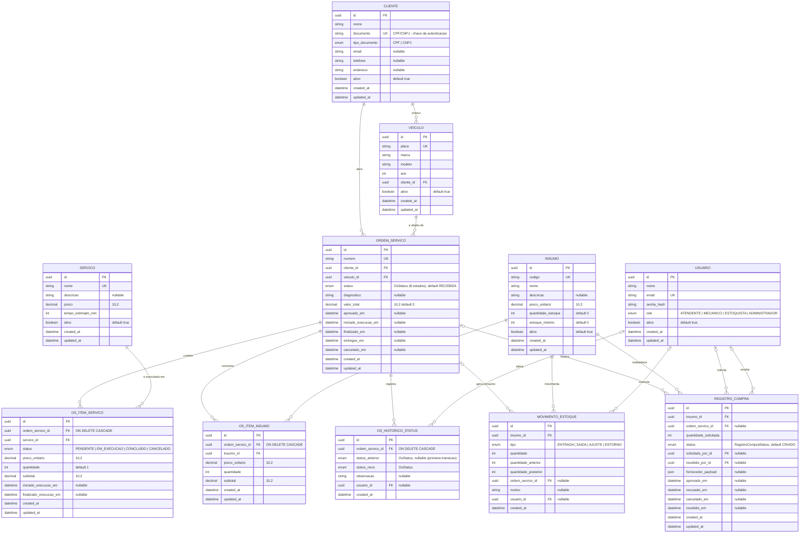

# Banco de dados — justificativa e DER

## 1. Justificativa formal do PostgreSQL/RDS

O modelo da oficina é fortemente relacional e transacional, e o PostgreSQL gerenciado via
RDS atende a cada exigência:

- **Integridade referencial forte.** O fluxo de OS encadeia cliente → veículo → ordem →
  itens de serviço/insumo → histórico de status. Chaves estrangeiras com `ON DELETE`
  explícito (cascata nos itens e no histórico da OS, `RESTRICT` implícito nas entidades de
  catálogo) impedem estados órfãos no banco, sem depender da aplicação.
- **Transações.** A criação da OS grava a linha de `ordens_servico` e a primeira de
  `os_historico_status` atomicamente; a movimentação de estoque grava o `MovimentoEstoque`
  e atualiza `insumos.quantidade_estoque` na mesma transação, com `quantidade_anterior` /
  `quantidade_posterior` registrados para auditoria. Isolamento ACID é requisito, não
  conveniência.
- **Tipos nativos.** `uuid` como PK de todas as tabelas; `Decimal(10,2)` para valores
  monetários (sem erro de ponto flutuante); e **enums nativos** para as máquinas de estado:
  `OsStatus` (8 estados), `OsItemServicoStatus`, `TipoMovimentoEstoque`,
  `RegistroCompraStatus`, `TipoDocumentoCliente`.
- **Migrações versionadas.** As migrações Prisma (`prisma/migrations/`) são versionadas no
  repositório e aplicadas pelo CD antes do deploy — o schema é reproduzível e auditável.
- **Operação gerenciada.** Backup automático, patch de versão e failover ficam a cargo do
  RDS, fora do escopo do time.

A escolha entre provedores e engines está registrada em
[RFC-002](rfcs/rfc-002-banco-de-dados-gerenciado.md); a topologia de instância única com
dois bancos lógicos, em [ADR-004](adrs/adr-004-ambientes-por-namespace-e-banco-logico.md).

## 2. Ajustes do modelo na Fase 3

**Nenhum ajuste estrutural.** O schema da Fase 2 já está normalizado (3FN) e cobre o
domínio inteiro. A Fase 3 muda o **acesso** ao dado, não o dado:

- A autenticação do cliente por CPF usa a coluna **`clientes.documento`**, que já existe e
  já é **`UNIQUE`**. É essa restrição de unicidade que torna a consulta da Lambda
  (`SELECT ... WHERE documento = :cpf`) segura — não há ambiguidade de qual cliente o token
  representa. `clientes.tipo_documento` (`CPF` | `CNPJ`) distingue a natureza do documento;
  o fluxo de login por CPF valida os dígitos antes da consulta.
- A rota de acompanhamento de OS pelo cliente reusa `ordens_servico` + `os_historico_status`
  já existentes, filtrando por `cliente_id`.

Se uma evolução futura alterar o schema, o ajuste e a migração correspondente devem ser
documentados nesta seção antes do merge.

## 3. DER

Derivado de `prisma/*.prisma` (fonte da verdade). Cardinalidade `|o` = lado opcional
(FK anulável); `||` = obrigatório; `o{` = zero-ou-muitos.

> No DER acima, os atributos de nota fiscal e de resposta do fornecedor em
> `REGISTRO_COMPRA` (`nota_fiscal_*`, `fornecedor_resposta_codigo`, `fornecedor_mensagem`,
> `motivo_recusa`, `motivo_cancelamento`) foram omitidos por serem campos de payload
> opcionais que não participam de relação; estão em `prisma/insumos.prisma`.

## 4. Relacionamentos — um parágrafo por relação

- **CLIENTE 1—N VEICULO** (`veiculos.cliente_id`, obrigatório). Todo veículo pertence a
  exatamente um cliente; um cliente pode ter vários veículos. Exclusão do cliente é
  bloqueada enquanto houver veículo (sem cascata).
- **CLIENTE 1—N ORDEM_SERVICO** (`ordens_servico.cliente_id`, obrigatório). A OS é sempre
  de um cliente; é essa FK que a rota de acompanhamento usa para garantir que o cliente
  autenticado só vê as próprias ordens.
- **VEICULO 1—N ORDEM_SERVICO** (`ordens_servico.veiculo_id`, obrigatório). Cada OS trata
  de um veículo; o mesmo veículo acumula várias OS ao longo do tempo. A aplicação valida
  que o veículo pertence ao cliente informado antes de criar a OS.
- **ORDEM_SERVICO 1—N OS_ITEM_SERVICO** (`os_itens_servico.ordem_servico_id`, `CASCADE`).
  Os serviços orçados/executados na OS. Apagar a OS apaga seus itens de serviço.
- **ORDEM_SERVICO 1—N OS_ITEM_INSUMO** (`os_itens_insumo.ordem_servico_id`, `CASCADE`).
  As peças/insumos consumidos na OS, com preço e subtotal congelados no momento do
  lançamento. Cascata na exclusão da OS.
- **ORDEM_SERVICO 1—N OS_HISTORICO_STATUS** (`os_historico_status.ordem_servico_id`,
  `CASCADE`). Trilha de auditoria da máquina de estados da OS: uma linha por transição,
  com `status_anterior`, `status_novo` e `created_at`. É a fonte da verdade das transições
  e a base do cálculo de `durationMs` no evento de log `os.status.changed`.
- **ORDEM_SERVICO 0..1—N MOVIMENTO_ESTOQUE** (`movimentos_estoque.ordem_servico_id`,
  anulável). Uma baixa de estoque pode ou não estar vinculada a uma OS — movimentos de
  ajuste e de entrada por compra não têm OS. Quando há, a FK liga o consumo à ordem que o
  motivou.
- **ORDEM_SERVICO 0..1—N REGISTRO_COMPRA** (`registros_compra.ordem_servico_id`, anulável).
  Uma compra de reabastecimento pode ser disparada por uma OS específica (falta de peça
  para executar) ou por reposição de estoque mínimo (sem OS).
- **SERVICO 1—N OS_ITEM_SERVICO** (`os_itens_servico.servico_id`, obrigatório). Liga o item
  da OS ao catálogo de serviços; o `preco_unitario` do item é uma cópia do preço vigente,
  não uma referência viva, para preservar o histórico financeiro.
- **INSUMO 1—N OS_ITEM_INSUMO** (`os_itens_insumo.insumo_id`, obrigatório). Idem para
  insumos: o item guarda o preço praticado no lançamento.
- **INSUMO 1—N MOVIMENTO_ESTOQUE** (`movimentos_estoque.insumo_id`, obrigatório). Todo
  movimento é de um insumo; a soma dos movimentos reconcilia com
  `insumos.quantidade_estoque`, e cada linha registra o saldo antes e depois.
- **INSUMO 1—N REGISTRO_COMPRA** (`registros_compra.insumo_id`, obrigatório). Cada pedido
  de compra é de um insumo específico.
- **USUARIO 0..1—N OS_HISTORICO_STATUS** (`os_historico_status.usuario_id`, anulável).
  Registra quem promoveu a transição de status. Anulável porque transições automáticas do
  sistema (ou registros migrados) não têm autor humano.
- **USUARIO 0..1—N MOVIMENTO_ESTOQUE** (`movimentos_estoque.usuario_id`, anulável). Quem
  executou o movimento de estoque; anulável pelo mesmo motivo.
- **USUARIO 0..1—N REGISTRO_COMPRA (solicita)** (`registros_compra.solicitado_por_id`,
  relação `registro_compra_solicitado_por`, anulável). Quem abriu o pedido de compra.
- **USUARIO 0..1—N REGISTRO_COMPRA (recebe)** (`registros_compra.recebido_por_id`, relação
  `registro_compra_recebido_por`, anulável). Quem confirmou o recebimento da mercadoria —
  em geral um estoquista, normalmente diferente de quem solicitou. As duas FKs coexistem na
  mesma tabela como relações nomeadas distintas no Prisma.

## 5. Revisão cruzada

O DER deve ser conferido campo a campo contra `prisma/*.prisma` por um membro do grupo que
não o redigiu. Pontos de atenção: os `UNIQUE` (`clientes.documento`, `usuarios.email`, `veiculos.placa`,
`servicos.nome`, `insumos.codigo`, `ordens_servico.numero`), os enums `OsStatus` e
`OsItemServicoStatus`, e as duas relações `USUARIO → REGISTRO_COMPRA`.
