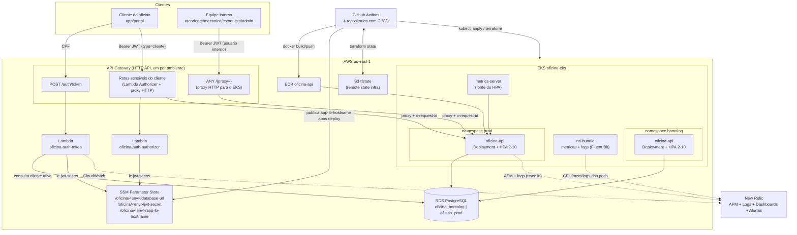

# Diagrama de Componentes

Visão de nuvem completa da solução da Fase 3: entrada pelo API Gateway, autenticação
serverless, aplicação no EKS, banco gerenciado, contratos via SSM, observabilidade e
pipelines de CI/CD.

> O diagrama mostra o ambiente `prod` recebendo tráfego externo pelo gateway; `homolog`
> tem a mesma topologia (gateway próprio, mesmas Lambdas em outro stage) e é omitido nas
> setas de request só para não poluir a figura.

## Legenda — componente por repositório

| Componente | Repositório | Papel |
| --- | --- | --- |
| `oficina-api` (NestJS, Clean Architecture) | `tc-oficina-app` | Regra de negócio da oficina: OS, clientes, veículos, serviços, estoque. Valida o JWT (interno e de cliente), emite logs estruturados, expõe `/health`. |
| Lambda `oficina-auth-token` | `tc-oficina-lambda-auth` | Recebe CPF, confere cliente ativo no RDS, assina JWT HS256 `type: "cliente"` (exp 1h). |
| Lambda `oficina-auth-authorizer` | `tc-oficina-lambda-auth` | Lambda REQUEST authorizer do API Gateway: valida o JWT nas rotas sensíveis do cliente, injeta `clienteId` no contexto. TTL de cache 300s. |
| API Gateway HTTP API (por ambiente) | `tc-oficina-lambda-auth` | `POST /auth/token` → Lambda token; rotas sensíveis do cliente → authorizer + proxy HTTP; `ANY /{proxy+}` → proxy HTTP para o LoadBalancer do EKS. |
| Cluster EKS `oficina-eks`, VPC, ECR, namespaces `homolog`/`prod`, `metrics-server`, `nri-bundle` | `tc-oficina-infra-k8s` | Base de computação. Primeiro repositório de infra a ser aplicado. |
| RDS PostgreSQL (`oficina_homolog`, `oficina_prod`), parâmetros SSM `database-url` e `jwt-secret` | `tc-oficina-infra-db` | Banco gerenciado único com dois bancos lógicos. Lê o remote state do infra-k8s para achar VPC/subnets. |
| Parâmetro SSM `app-lb-hostname` | `tc-oficina-app` (CD) | Publicado pelo CD do app após o deploy; consumido pelo Terraform do `tc-oficina-lambda-auth` para apontar o proxy HTTP do gateway ao EKS. |
| Dashboards, alertas e runbook de observabilidade | `tc-oficina-app` (`docs/observabilidade/`) | JSONs versionados dos 2 dashboards + políticas de alerta. |
| CI/CD (GitHub Actions) | os 4 repositórios `tc-oficina-*` | Pipelines independentes por repositório; ambientes `homolog` (branch `develop`) e `prod` (branch `main`). |
| Perfil público da organização | `.github` | `profile/README.md` com a lista de repositórios e participantes. |

## Contratos entre repositórios

- **SSM Parameter Store** é o único acoplamento em runtime. `tc-oficina-infra-db` produz
  `database-url` e `jwt-secret`; o CD de `tc-oficina-app` produz `app-lb-hostname`; app e
  Lambdas consomem o que precisam. Nenhum serviço lê o Terraform state de outro repositório.
- **S3 remote state** liga só os dois repositórios de infra: `tc-oficina-infra-db` lê o
  state de `tc-oficina-infra-k8s` para descobrir `vpc_id`, `public_subnet_ids` e
  `vpc_cidr_block`.
- **Ordem de aplicação obrigatória:** `infra-k8s` → `infra-db` → `lambda-auth` (depende de
  `app-lb-hostname`, que só existe após o primeiro deploy do app) → `app`.

Detalhamento em [ADR-001](adrs/adr-001-quatro-repositorios-e-contratos-ssm.md).
