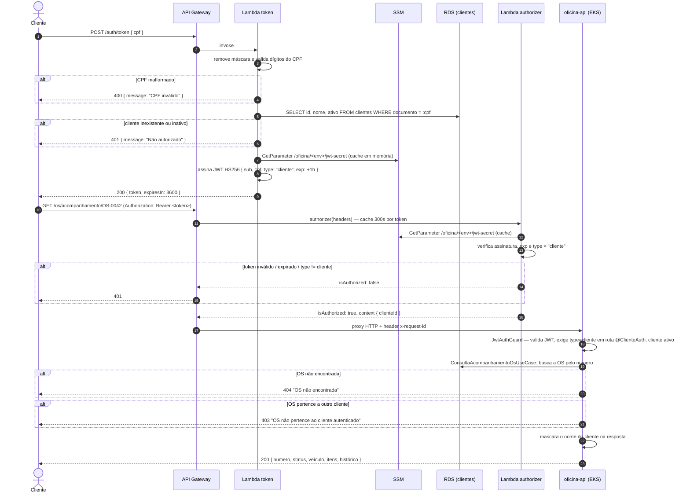

# Sequência — Autenticação do cliente via CPF

Fluxo completo: emissão do token a partir do CPF e uso do token numa rota sensível do
cliente (acompanhamento de OS).

## Notas

- **Dupla validação do JWT** (authorizer + `JwtAuthGuard` no app) é intencional: o gateway
  barra o tráfego não autenticado antes de chegar ao cluster, e o app revalida porque
  também aceita tokens de usuário interno emitidos pela própria API — o mesmo guard decide,
  pelo claim `type`, se a rota é permitida (`@ClienteAuth()` só aceita `type: "cliente"`;
  rotas internas rejeitam esse tipo).
- **`jwt-secret` compartilhado** via SSM permite que Lambda (assina) e app (valida) usem o
  mesmo segredo HS256 sem troca de chave pública. Rotação = trocar o parâmetro + rollout.
  Ver [ADR-003](adrs/adr-003-jwt-hs256-segredo-compartilhado.md).
- **`x-request-id`** é injetado/propagado pelo gateway e reaproveitado pelo app como
  `requestId` em todos os logs da requisição, fechando a correlação ponta a ponta exigida
  pelo enunciado. Ver [sequência de abertura de OS](sequencia-abertura-os.md) e o
  [runbook de observabilidade](../observabilidade/README.md).
- **401 genérico** na Lambda token não diferencia "CPF não existe" de "cliente inativo",
  para não vazar informação sobre a base de clientes.
